(Understanding this is key to CI/CD automation)

---

## 🛠️ Tech Stack & Tools Used

| Component | Technology |
|-----------|------------|
| CI/CD | Jenkins |
| Containerization | Docker |
| Cloud | AWS EC2, AWS ECR |
| Version Control | GitHub |
| Webhook | GitHub webhook |
| IaC | Terraform |
| OS | Ubuntu |

---

## 📸 Project Screenshots

### 🏗️ EC2 Instance Creation
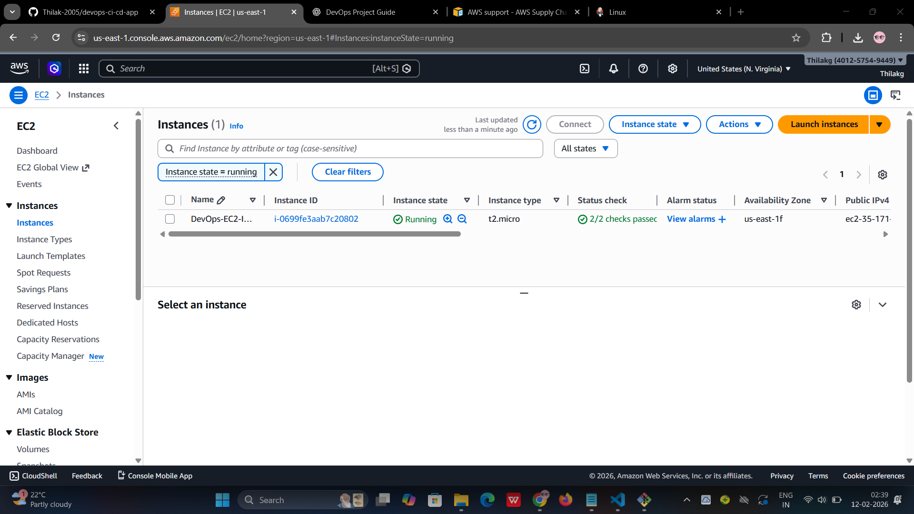

---

### 🔐 Security Group (SSH, HTTP, App Port)


---

### ☁️ Updating Packages on EC2
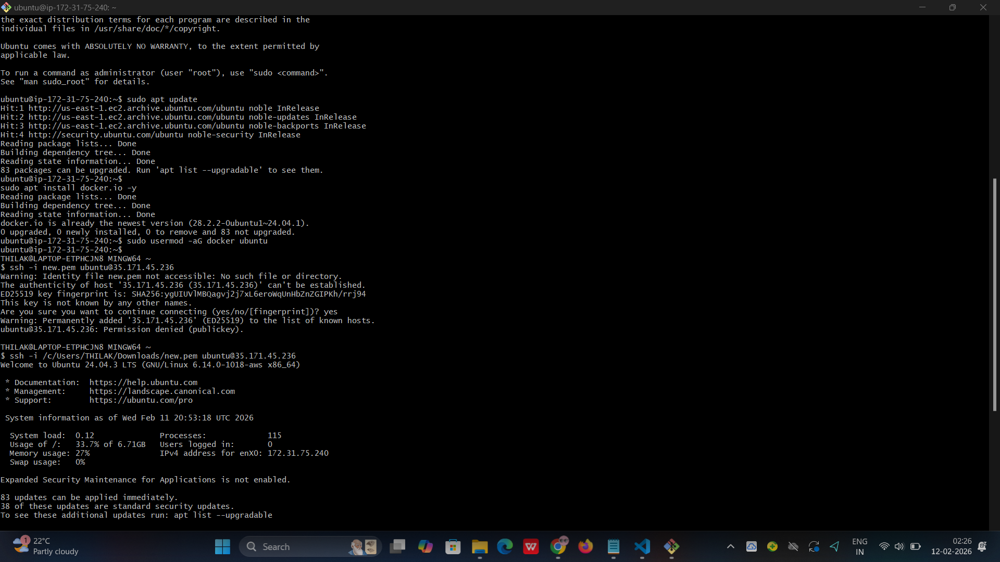

---

### ☕ Java Installation (Required by Jenkins)
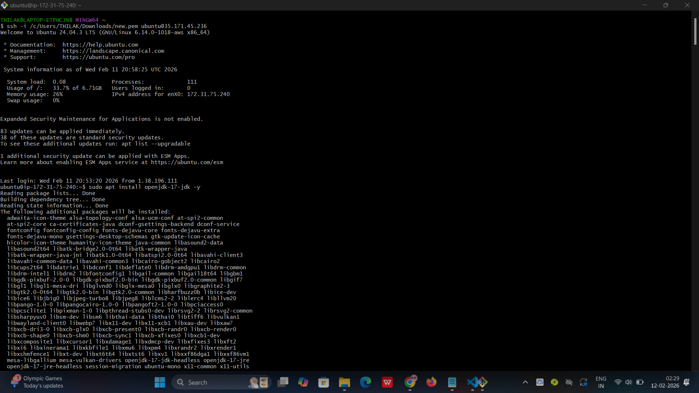

---

### ⚙️ Installing Jenkins on EC2
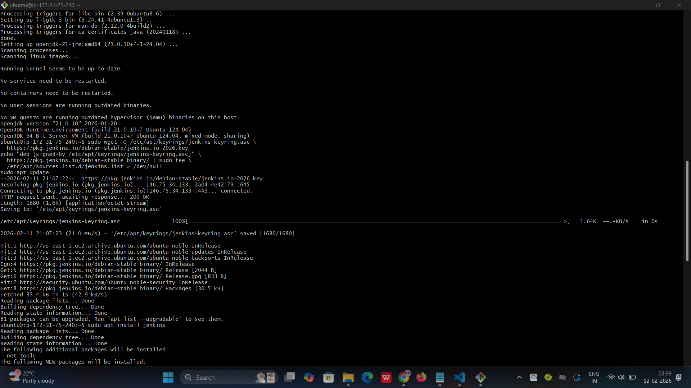

---

### 🚀 Jenkins Running on EC2


---

### 🔐 Jenkins Login Page
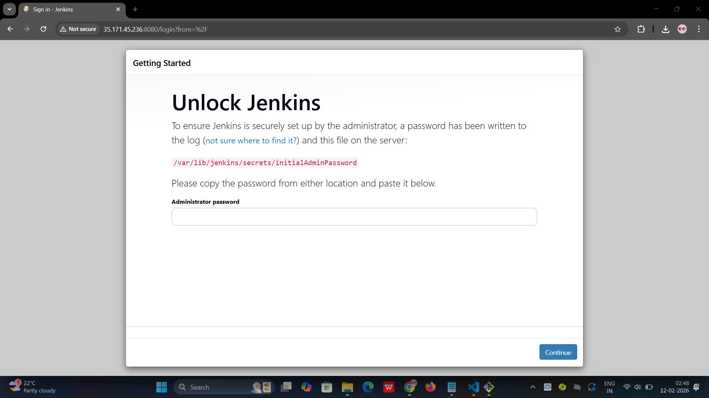

---

### 🔑 Jenkins Admin Credentials
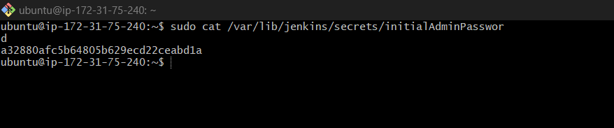

---

### 📦 Installing Jenkins Plugins
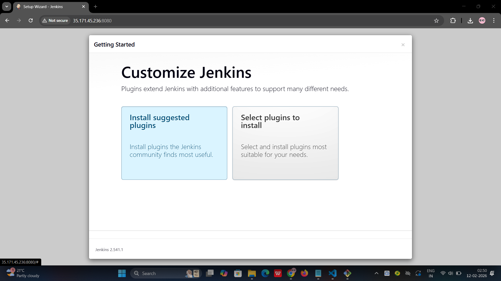

---

### 🐳 Installing Docker on EC2


---

### 📦 AWS ECR Repository


---

### 🔑 AWS Credentials Configured in Jenkins
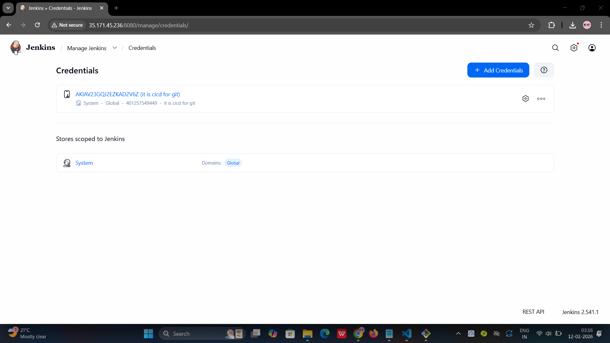

> Credentials stored in Jenkins credentials manager to allow ECR access.

---

### 🐙 GitHub Source Code


---

### 🔗 GitHub Webhook Setup


---

### 🔔 Webhook Test Trigger


---

### 📂 Pipeline Project Setup in Jenkins


---

### 📜 Jenkinsfile (Pipeline Script)


---

### ▶️ Jenkins Pipeline Execution


---

### 🏃 Job Execution
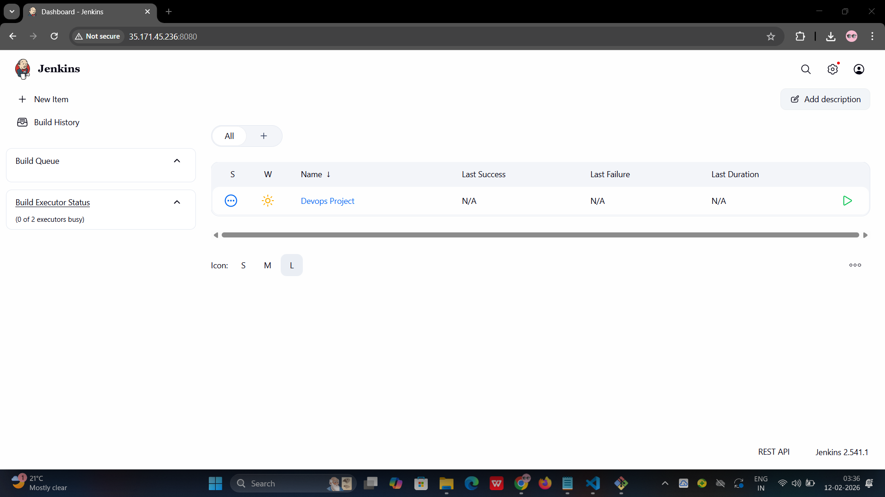

---

### 📊 Jenkins Dashboard View
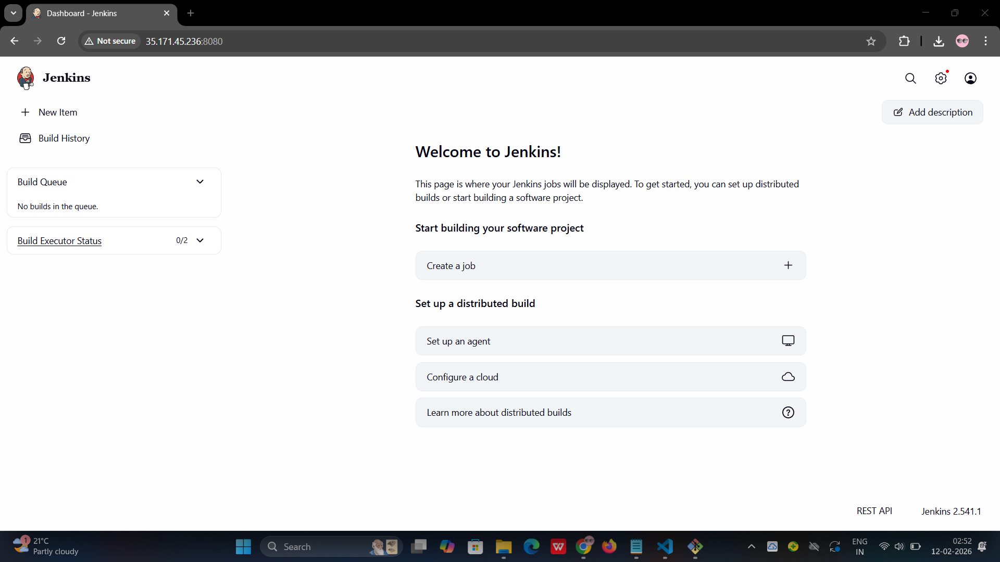

---

### 🖥️ Console Output (Build Logs)
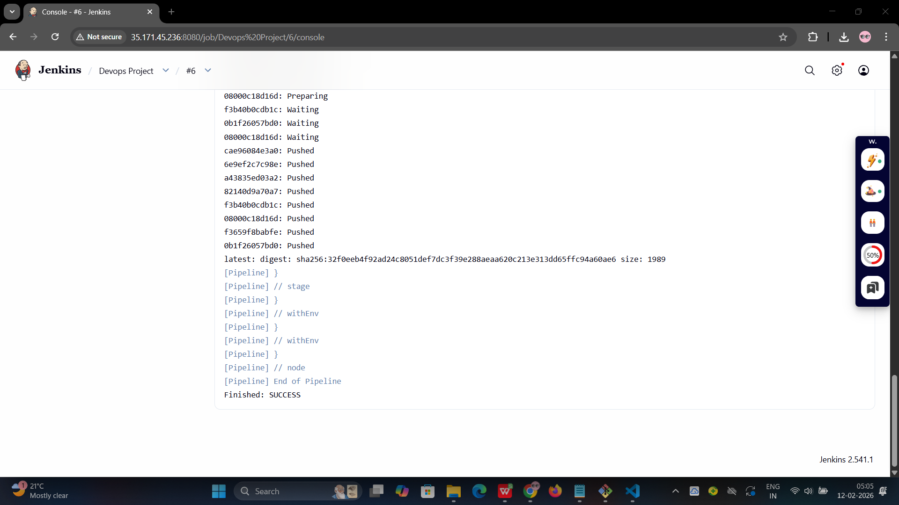

---

### 📑 Detailed Build Logs
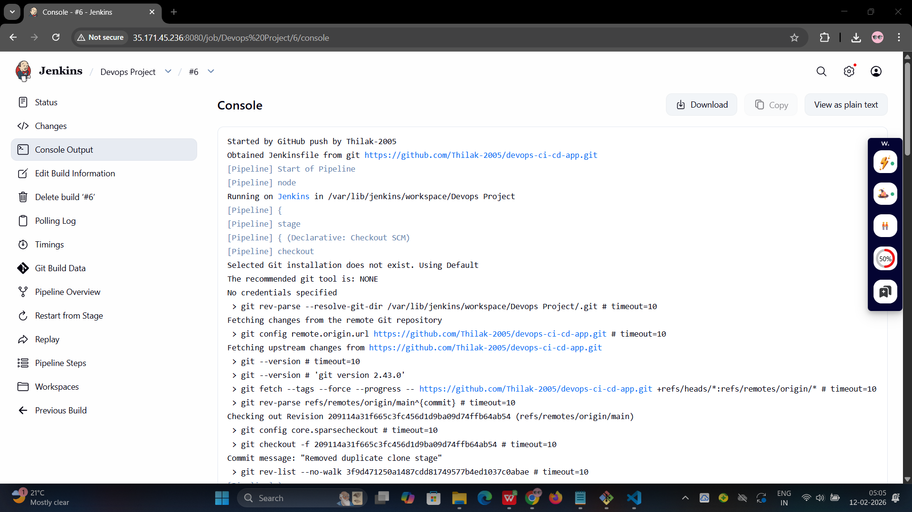

---

### ❌ Failed Job (Debug View)
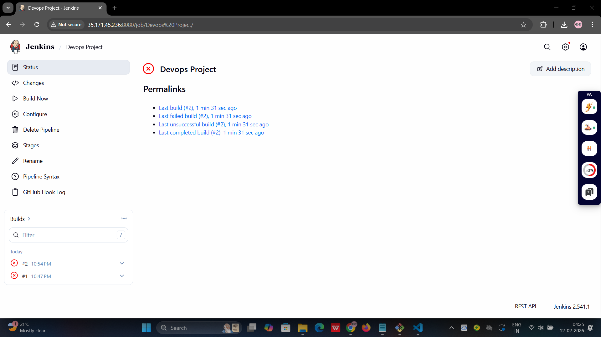

---

### ❌ Failed Dashboard View
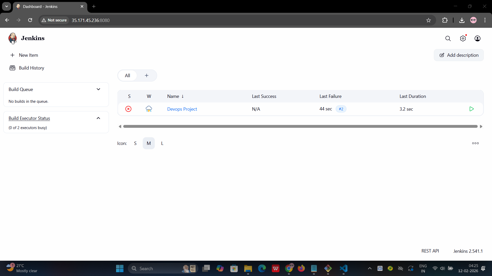

---

### 🔴 Error Output in Pipeline


---

### 🌐 Final Deployed Application Output
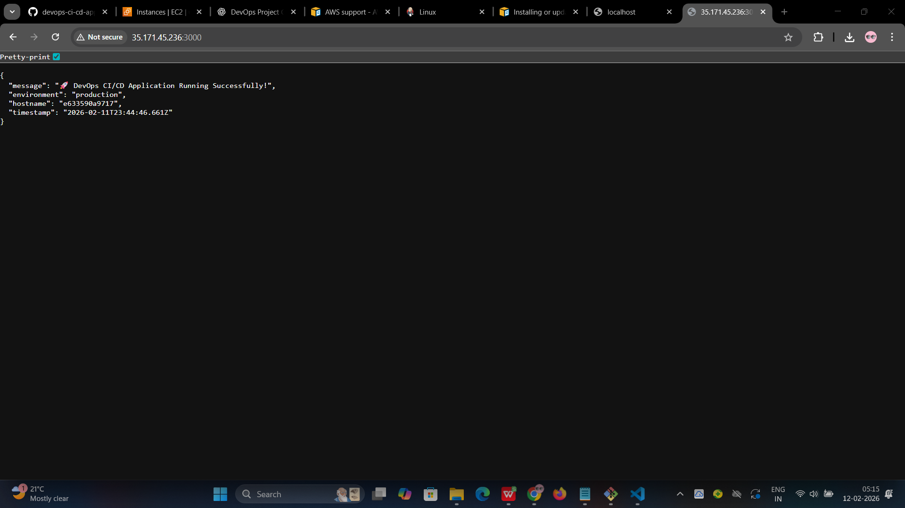

---

## 🔁 CI/CD Workflow Summary

1. Make code changes locally  
2. Push changes to GitHub  
3. GitHub Webhook triggers Jenkins  
4. Jenkins pulls code  
5. Builds Docker image  
6. Logs into AWS ECR  
7. Tags & pushes image to ECR  
8. (Optional) EC2 pulls image & runs container

---

## ⚙️ How to Test the Project

### 1️⃣ Clone this repo
```bash
git clone https://github.com/Thilak-2005/devops-ci-cd-app.git

