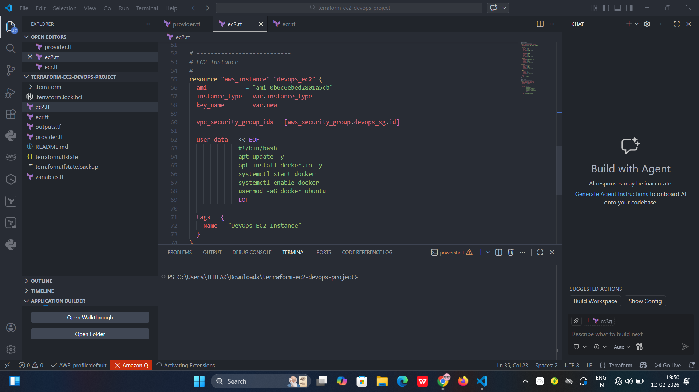

# 🚀 DevOps CI/CD Pipeline using Jenkins, Docker, AWS EC2 & ECR (with Terraform)

This project demonstrates a complete **CI/CD pipeline automation** using:

- GitHub
- Jenkins
- Docker
- AWS EC2
- AWS ECR
- Terraform (Infrastructure as Code)

Whenever code is pushed to GitHub, Jenkins automatically builds a Docker image and pushes it to AWS ECR.

---

# 🏗️ Architecture Overview

.png).

## 🔹 Terraform Infrastructure Code

Terraform is used to provision AWS infrastructure like EC2 and Security Groups.

---

# ☁️ AWS Infrastructure Setup

## 🔹 EC2 Instance Creation

EC2 instance launched to host Jenkins and Docker.

---

## 🔹 Security Group Configuration

Inbound rules configured for:
- SSH (22)
- HTTP (80)
- Jenkins (8080)
- Application Port

---

## 🔹 Updating EC2 Packages

System packages updated before installing dependencies.

---

# ⚙️ Jenkins Installation & Setup

## 🔹 Java Installation (Required for Jenkins)

---

## 🔹 Installing Jenkins

---

## 🔹 Jenkins Running on EC2

---

## 🔹 Jenkins Login Page

---

## 🔹 Jenkins Admin Credentials Setup

---

## 🔹 Installing Required Jenkins Plugins

---

# 🐳 Docker Installation

## 🔹 Installing Docker on EC2

Docker is required to build and run containers.

---

# 📦 AWS ECR Setup

## 🔹 AWS ECR Repository Created

Private Docker registry for storing application images.

---

## 🔹 AWS Credentials Configured in Jenkins

IAM credentials stored securely inside Jenkins.

---

# 🐙 Application & Source Code

## 🔹 Application Source Code

Node.js application stored in GitHub.

---

# 🔗 GitHub Webhook Integration

## 🔹 GitHub Webhook Setup

Webhook triggers Jenkins automatically on every push.

---

## 🔹 Webhook Testing

Testing successful webhook delivery.

---

# 🏗️ Jenkins Pipeline Configuration

## 🔹 Pipeline Project Creation

---

## 🔹 Jenkinsfile (Pipeline Script)

Pipeline stages include:
- Clone Code
- Build Docker Image
- Login to ECR
- Tag Image
- Push to ECR

---

## 🔹 Jenkins Pipeline Dashboard

---

# ▶️ Pipeline Execution

## 🔹 Running Pipeline

---

## 🔹 Running Job View

---

## 🔹 Console Output Logs

---

## 🔹 Detailed Console Logs

---

# ❌ Failure Debugging

## 🔹 Failed Job

---

## 🔹 Failed Dashboard

---

## 🔹 Error Output in Pipeline

---

# 🌐 Final Application Output

## 🔹 Deployed Application Running

Application successfully built, pushed to ECR, and deployed.

---

# 🔄 CI/CD Workflow Summary

